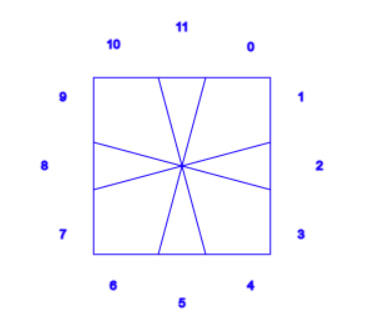
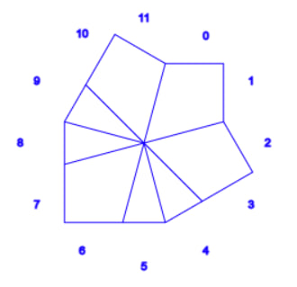
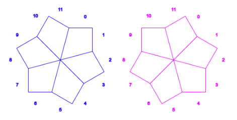

# square-one

Having fun with [square-1 puzzle](https://en.wikipedia.org/wiki/Square-1_%28puzzle%29)

# Chapter one: Shapes
 * How many reachable shapes (ignoring elements colors) exist?
 * How to get from one shape to another?
 
#### Modelling

Consider cube's top edge. Let's assign indexes to cube elements like so:
 

Let's code kite pieces with `11` and triangle pieces with `0`

So the shape:

would be encoded as `111100110011`

For the case when all side pieces are kite pieces, we need a flag marking that side starts with piece 'cub' by zero axis.
The case:

`data Side = Side {code :: Int, isCut :: Bool} deriving Eq`

 
  
