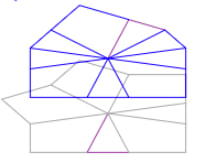
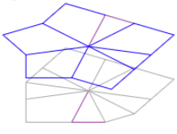
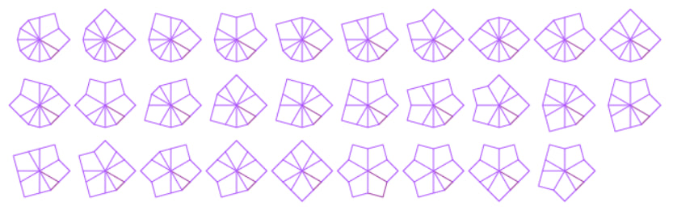
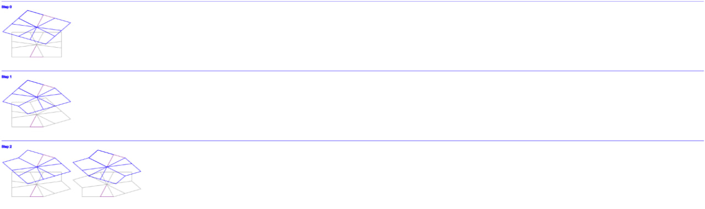
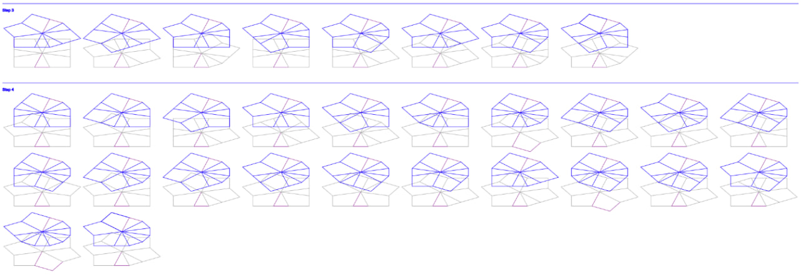
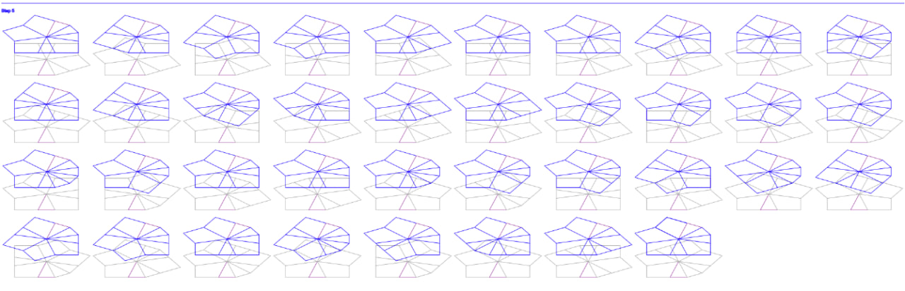
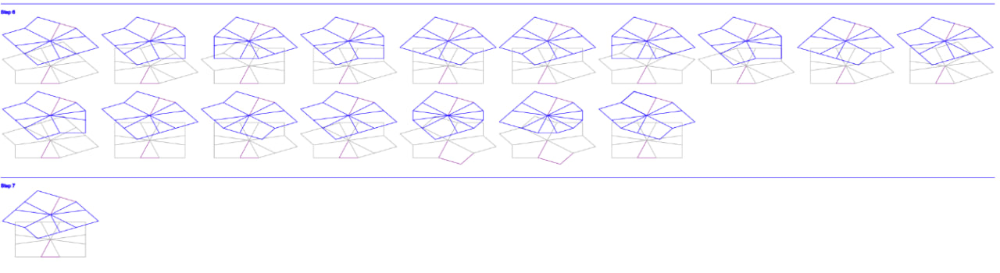

# square-one

Having fun with [square-1 puzzle](https://en.wikipedia.org/wiki/Square-1_%28puzzle%29)

# Chapter one: Shapes
 * How many reachable shapes (ignoring elements colors) exist?
 * How to get from one shape to another?
 
#### Modelling

Let's model cube the following way:

`data Cube = Cube {up :: Side, down :: Side} deriving (Show,Eq)`

Consider cube's edge. Let's enumerate each of 12 side segments 30 degrees each like so: 

 

There are two types of Side piece: triangle, taking one sector of 30 degrees and kite element taking two places:

`data Piece = Triangle | Kite deriving (Eq, Ord, Enum, Show)`

Let's define side as list of pieces enumerated clockwise from zero index. As far as kite element might take two 
positions with indexes 11 and 0 we need some marker to distinguish such cases

 

So the side model is:

`data Side = Side {pieces :: [Piece], isCut :: Bool} deriving Eq`

Let's assume that whole cube rotation around X axis (X2) is equivalent to switching cube's up and down sides without any 
pieces order change

Cube example, zero-index piece marked with purple:

`up:   Trangle, Trangle, Trangle, Kite, Trangle, Kite, Trangle, Trangle, Kite;
down: Triangle, Kite, Triangle, Kite, Kite, Kite, Kite;`

`up:   Triangle, Kite, Triangle, Kite, Kite, Kite, Kite;                          
down: Trangle, Trangle, Trangle, Kite, Trangle, Kite, Trangle, Trangle, Kite;`

Now the flipping right cube's half around in plane 11:0 - 5:6 is just swapping side's pieces in positions 0-5 

To enumerate all reachable cube shapes we need: 

- get a list of cubes derived from the given cube
- from derived cubes get previously unseen ones
- until step 2 gives cubes, repeat steps 1 and 2 
  
How to check if two cubes are the same? Let's consider two cubes equal if one of cubes may
be get from another by rotating it's sides or by 180 degrees rotating of the whole cube.

Some REPL play around gives the full list of reachable `Side` shapes:

 

The evolution of reachable unseen `Cube` shapes from `done` cube:

